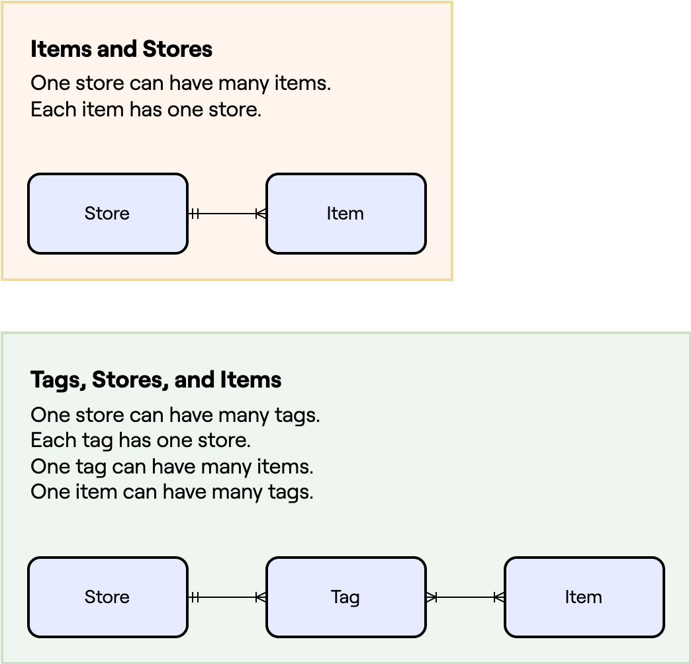

# Changes in this section

It's common for online stores to use "tags" to group items and to be able to search for them a bit more easily.

For example, an item "Chair" could be tagged with "Furniture" and "Office".

Another item, "Laptop", could be tagged with "Tech" and "Office".

So one item can be associated with many tags, and one tag can be associated with many items.

This is a many-to-many relationship, which is bit trickier to implement than the one-to-many we've already implemented between Items and Stores.

## When you have many stores

We want to add one more constraint to tags, however. That is that if we have many stores, it's possible each store wants to use different tags. So the tags we create will be unique to each store.

This means that tags will have:

- A many-to-one relationship with stores
- A many-to-many relationship with items

Here's a diagram to illustrate what this looks like:

## New API endpoints to be added

In this section we will add all the Tag endpoints:

| Method   | Endpoint              | Description                                             |
| -------- | --------------------- | ------------------------------------------------------- |
| `GET`    | `/store/{id}/tag`     | Get a list of tags in a store.                          |
| `POST`   | `/store/{id}/tag`     | Create a new tag.                                       |
| `POST`   | `/item/{id}/tag/{id}` | Link an item in a store with a tag from the same store. |
| `DELETE` | `/item/{id}/tag/{id}` | Unlink a tag from an item.                              |
| `GET`    | `/tag/{id}`           | Get information about a tag given its unique id.        |
| `DELETE` | `/tag/{id}`           | Delete a tag, which must have no associated items.      |